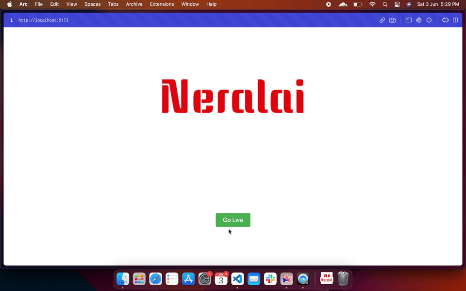

<div align="center">
<p align="center">
  
  <h4> A simple media server in go with WHIP for ingress and HLS for egress</h4>
</p>
  <p>
     <a href="https://github.com/coder-with-a-bushido/neralai/stargazers/">
        
     </a> 
     <a href="https://goreportcard.com/report/coder-with-a-bushido.in/neralai">
     </a>
     <a href="https://github.com/coder-with-a-bushido/neralai/blob/main/LICENSE">
       
     </a> 
  </p>
</div>

---



## Running

Clone the repo and run the command

```sh
go run main.go
```

The server will run on port 8080 by default. Now, open the `client/` directory and run it for demo.
