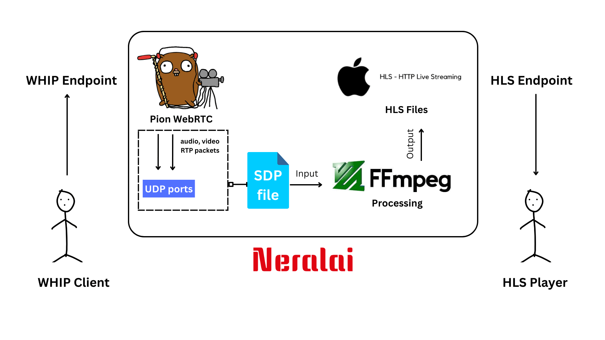

<div align="center">
<p align="center">
  
  <h4> A simple media server in go with WHIP for ingress and HLS for egress</h4>
</p>
  <p>
     <a href="https://github.com/coder-with-a-bushido/neralai/stargazers/">
        
     </a> 
     <a href="https://goreportcard.com/report/github.com/coder-with-a-bushido/neralai">
     </a>
     <a href="https://github.com/coder-with-a-bushido/neralai/blob/main/LICENSE">
       
     </a> 
  </p>
</div>

---



## How does it work?

1. A WHIP client sends media to Neralai using the WHIP endpoint `/stream`.
2. The media is forwarded to `ffmpeg` for processing; HLS files are generated.
3. Once the stream starts, the playlist file can be accessed by any HLS player from the endpoint `/stream/{resourceId}/hls/stream.m3u8`.
4. The stream can be stopped with a DELETE call to `/stream/{resourceId}`, as supported by WHIP clients.

## Running

Clone the repo and run the command

```sh
go run main.go
```

The server will run on port 8080 by default. Now, open the `client/` directory and run it for demo.

---

Built with 🫶 and

- [Pion WebRTC](https://github.com/pion/webrtc)
- [FFmpeg](https://ffmpeg.org/)
- [chi](https://github.com/go-chi/chi)
- [Nano ID](https://github.com/aidarkhanov/nanoid)
