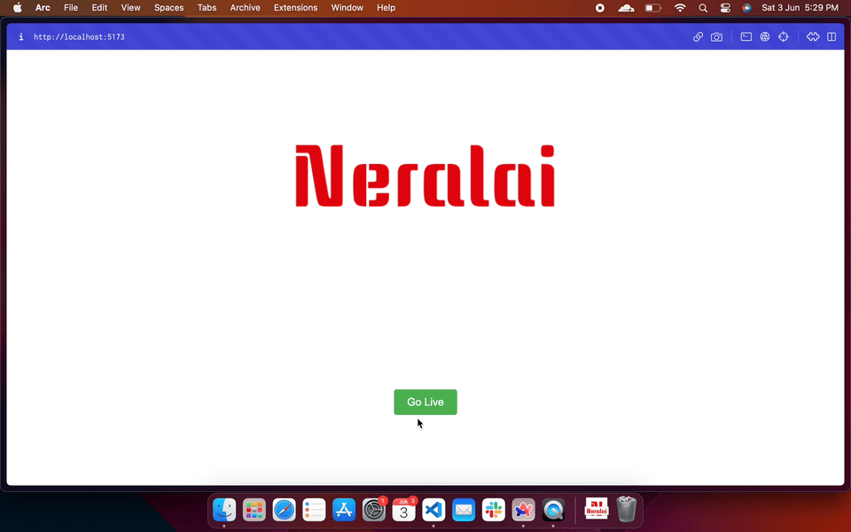

<h1> Client</h1>

A simple  client to demo streaming your camera and viewing that stream in a browser.



Install dependencies

```sh
npm i
```

Run the demo

```sh
npm run dev -- --open
```

---

Built with 🫶 and

- [Svelte](https://svelte.dev/)
- [WHIP web client](https://www.npmjs.com/package/@eyevinn/whip-web-client)
- [HLS.js](https://hlsjs-dev.video-dev.org/)
